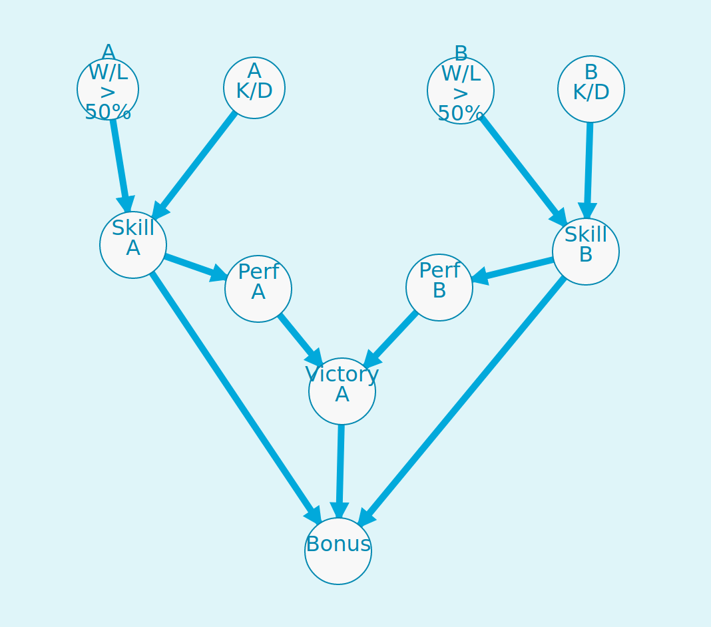

# FPS-Victory-BayesianNetwork
<p align="center">
   
</p>

This project describes a simple Bayesian Network model for assessing players' victory in a 1v1 FPS game match, inspired by .

# Requirements
Our code only requires pgmpy as a dependency:
```
pip install pgmpy
```

Note: pgmpy requires PyTorch, which can mess your CUDA installation, so we recommend running it as a Colab notebook.

# Code
The code is available as a jupyter notebook in  file.
